# 405th Deployment Visual Guide
*last updated June 2025

**Important Reminder:** Deployment is an *optional* process in the 405th. A deployed costume is *not* a requirement for 405th or Regiment Membership. The default view on 405th events is that all costumes are welcome and participation is not not limited to Deployed costumes only.  The Deployment process is intended for two things.  
1.  To serve as formal recognition of a member's hard work in completing a Halo Universe Costume.  
2.  To offer unbiased feedback and constructive criticism of a build by sorting it into one of three "Tiers."

The Three Tiers of Deployment of are:

- **Tier 1** is for those that have successfully completed a Halo Universe costume, but might have inaccuracies, construction issues, or have some fitting errors.

- **Tier 2** is for those costumes that have achieved a superior level of fit, construction, and accuracy, but might still be missing some details or have inaccuracies.

- **Tier 3** is for those costumes that have achieved a level of accuracy and fit that they appear to have stepped right out of the game.

The Tier a costume is given is based on three factors: 
- construction
- accuracy
- fit/scale to the wearer  

All three are considered when a costume is reviewed.  For example, a costume with Tier 3 equivalent construction and accuracy but has mis-scaled parts would not qualify for Tier 3 status, being limited to Tier 2 by the scaling and fit of the costume.  As such, Tiers 1 and 2 will exhibit a range of costumes in each respective tier.  Members are under no obligation to change, rebuild, or upgrade their costume after being deployed.  The advice and feedback given are only if the member so chooses to continue working on their costume to make it the best they can. 

*Please note that Deployment is reserved for **Regimental Members** of the site, which are those members who have had a registered account for more than 90 days and have made more than 50 posts and joined their respective local 405th Regiment.

# Eligible Costumes:
While most people tend to think of armored costumes like SPARTANs and ODSTs when they think of Halo Costuming, the 405th and our Deployment program is open to all costumes that appear in an official published, official Halo Universe source, including Games, Comics, Novels, Art Books, movies, and TV Shows.  Human, Covenant, Forerunner, Soldier, Scientist, Civilian, and AI, all Halo Universe characters are eligible for Deployment.

## Concept Art Costumes

Costumes based on Concept Art are applicable for Deployment only when the designs have been published in an Official Microsoft or Halo Studios publication, such as an "Art of" book. Designs posted on an individual Artist's website or social media but not seen in an official publication are not deployable. 

Moreover, if the only visual depiction of a costume does not contain a full 360 view of the costume it will still be eligible for Deployment, but will be unable to achieve a **Tier 3**, as there is not enough information to do a complete objective evaluation of the build's accuracy and would be limited to a **Tier 2**.

The Following is an example of Concept art by 343 Artist Kory Hubbell that would not be eligible for **Tier 3** because we do not have a full view of the Character: 

The Following is an example of Concept art by 343 Artist Kory Hubbell that would be eligible for **Tier 3** because we do have a full view of the Character:
 

No original, fan designed armor sets, permutations, or armor components and accessories are applicable for Deployment.  These are things like custom shoulders or helmets that are not seen in any game, but were designed as an original, custom armor component by the builder or non Bungie or 343/Halo Studios Artist.

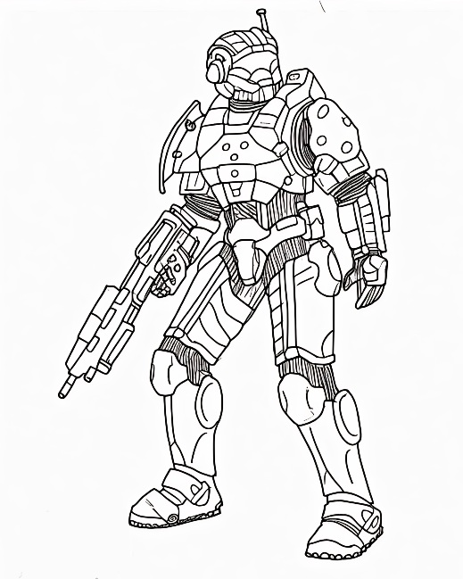

The above is an example of a fan designed armor set that would not be eligible for Deployment.

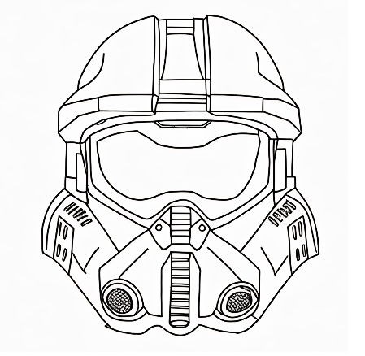

This is an example of a Star Wars and Halo mash up helmet concept that would not be eligible for Deployment.

# General Guidelines

The Following are general guidelines, each costume will have specific requirements and items that are looked at and evaluated.

## Tier 1:

- Costume must be complete with all primary components present. Any missing primary components will make a costume ineligible for Deployment.
    - Primary components will be determined on a costume by costume basis 
    - An item or component becomes optional for Deployment when in game or in universe references show that an item or component varies in appearance, location, or presence
    - e.g. pouches or ammo bandoliers on ODSTs, armor/helmet accessories in Halo Reach Armor

- Costume may have inaccuracies in color on under suits, soft goods, and in armor paint jobs. Under suit colors or armor paint job may feature colors or patterns not seen in game.

- Costume details may be "soft" or not well defined. If all armor or primary components are physically present, some details maybe missing or omitted for Tier 1.

- "Polygonal" appearance from use of Pepakura style methods may be present. 

- Visible Seams in Foam Armor may be present.

- 3D Printed Items may have visible print lines.

- Costume may lack a neck seal or have visible skin that is not present in game.

- Armor may have fitting or proportion scaling issues. 
    - e.g. Slightly over or under sized pieces.

- SPARTAN armor under suits or "Tech Suits" may lack details. Under suits may be plain fabric like Under Armour® or "Morphsuits" or regular clothing.

- If the costume consists of only the SPARTAN undersuit or Tech Suit, such as the "Off Duty" SAPRTAN-IVs feature in SPARTAN Ops cut scenes and some comics, then some details of the under suit must be present.

- Weathering, including physical damage, black washes, dirt, grime, and exposed silver paint may be either more or less than depicted in-game or in visual references.

- Armor personalization marks or graffiti may include non-canon references or images, such as references or symbology from other fictional universes, e.g. the Overwatch logo or Fallout's Brotherhood of Steel.

### Tier 1 Suits Examples:

This H4 Spartan is noticeably using the foam method evidenced by the angular nature, lacks some details present on H4 armor styles, and has a flat paint job that doesn't match the styling seen in games.

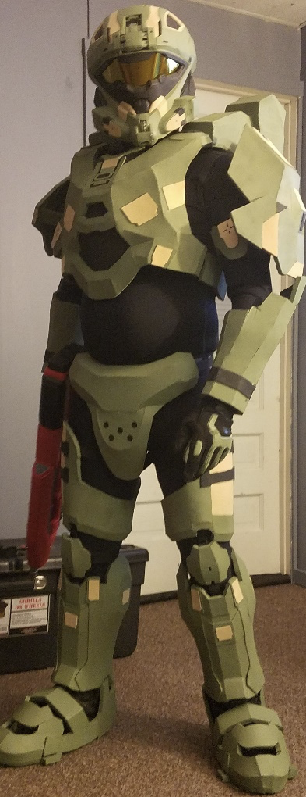

Some items to note on this Halo CE Mk V build is the lack of smoothing work done to cut down on the angular nature beyond what would be present in game, scaling issues particularly regarding the shins and boots, and a noticeable level of warping to the helmet.
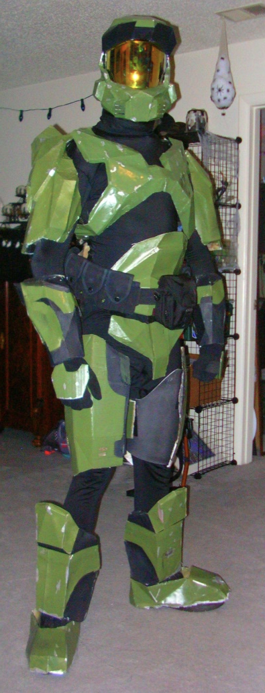

## Tier 2:

- If a Neck Seal is present in-game or in reference, a bare neck is not eligible and the costume must have some form of neck covering

- No prominent manufactures logos are visible on gloves, neck seal/balaclava, or other under suit items.

- Costume may still have inaccuracies in colors or patterns in armor paint schemes, but these items should demonstrate a higher level of fit into the Halo Universe.

- Armored costume under suits will have greater details and be a better match to in game references in material and color selection. For example: SPARTANS will not use camouflage pattern BDUs as their under suit.

- Costume may have paint details or decals that simulate armor graffiti or personalization must reference items, groups, or historical incidents that exist within the Halo Universe. For example Phrases such as "Remember Reach" or UNSC or ONI related logos or markings. Generic phrases like "Follow Me" or "Come Get Some" and generic logos like the "Skull and Crossbones," "Smiley Face", or animals are acceptable but references to other fictional universes, like the Star Wars Rebel Starbird or Transformers Autobot logo, are no longer acceptable for **Tier 2**.

- Halo 4 and 5 tech suits will attempt to visually replicate details.

- Pepakura pieces have had significant smoothing done.

- Foam pieces have had their seams minimized.

- 3D Printed pieces have had a high level of sanding and smoothing done.

- Armor sets having handplates will have physical handplates in the correct shape and style. For **Tier 2** repainted "Paintball" padded gloves are not acceptable in place of hand armor.

### Tier 2 Suit Examples:

In this ODST example the gloves lack the ODST details and are recognizable as commercial tactical style gloves, missing markings such as UNSC logo and the MK 117 on the chest plate seen in game, and is missing some of the detail pieces like shoulder strap buckles.

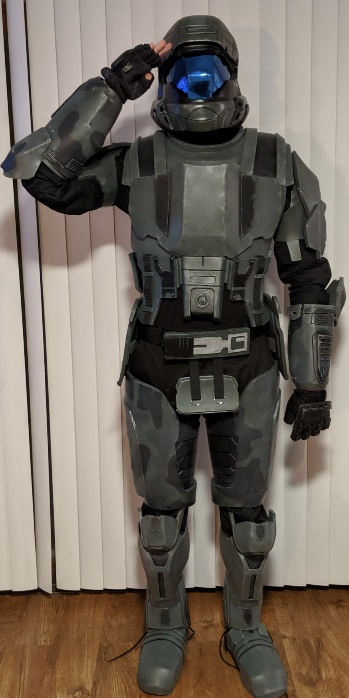

This CE MK V is using a plain black undersuit that lacks any details such as those that go on the backs of the knees, has a visible gap where the chest and back meet under the wearer's arms, and there are some scale and proportion issues particularly in the case of the boots.

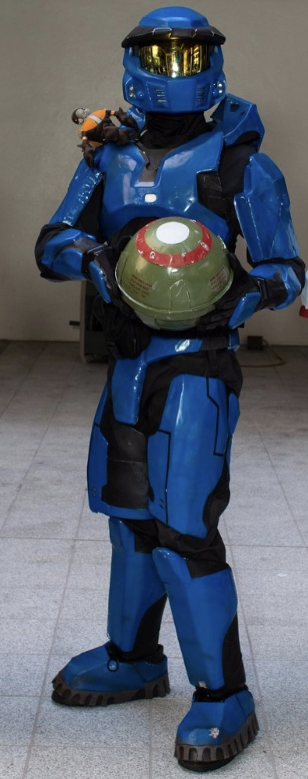

## Tier 3:

- Costume must appear to have virtually "stepped off the screen."

- Pepakura and 3D printed costumes must be fully finished or smoothed and foam costumes have no visible seams.

- Paint scheme patterns, color, and placement must match references or be able to be replicated in multiplayer customization.

- Logos, symbols, and personalization appearance and placement must match references or be able to be replicated in multiplayer customization. 

- Official 405th Division or Regiment logos may be used in place of any in-game logo or symbol and still qualify for **Tier 3**.

- Costume proportions must match in-game appearance and costume must be fitted to the wearer.

- Details must be replicated as close as possible and be present.

- Costumes with under suit details have had those details recreated either physically by sewing seams in an accurate position, or the use foam, rubber, or leather pieces glued or sewn in place to recreate raised details or by the use of a high quality painted or dye sublimated suit.

- Armor attachment system and any strapping system are not overtly visible.

- Weathering, if present in game or in the visual reference, must be replicated in patterns, details, and appearance.  For example, A **Tier 3** Jorge-052 armor set will have paint chipping, scratches, and visibly weathered armor, whereas a Jorge-052 armor set submitted without any weathering to the armor would be **Tier 2**. 

- "Optional Accessories" like pouches or ammo bandoliers on characters like ODSTs or Marines that exhibit a variety of placement schemes in-game must be shown to match an in-game reference.

- Individual costumes and costume types will have different **Tier 3** specific details that must be present. Examples include: "layered" padding or armor on interior of ODST thighs, under suit details on Halo Reach styled SPARTAN abdominal areas, under suit details on Halo 4 and 5 "Tech Suits."

- Costume must have a full 360 degree visual reference to compare the submitted member costume too.

### Tier 3 Suit Examples:
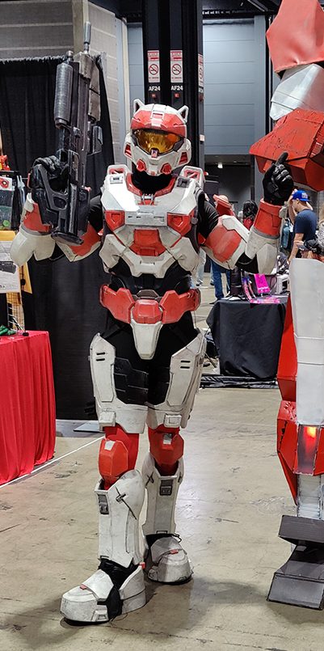 
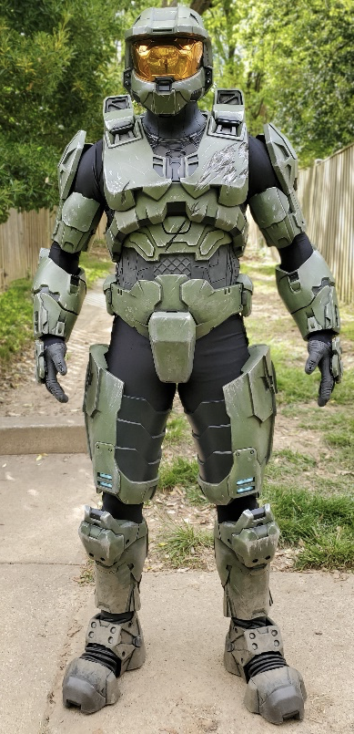  

## Special Categories:
### Mash Up Costumes

- These are Halo costumes "mashed up" with Pop Culture characters. Examples include "Captain America" SPARTANs or "HALO Kitty."

- These costumes are only approvable at a **Tier 1** Level.

- Popular culture mash up may be generated by paint scheme or addition of non-canon accessories.

- Costume must have a complete Halo Universe costume as a base with all primary components of that costume present.

- Additional details must be cosmetic in applications only, so if they were removed the base costume would still be a deployable **Tier 1** costume.

This Mash Up Costume does not feature a complete Halo Universe costume at its base, and as such would not be Deployable:

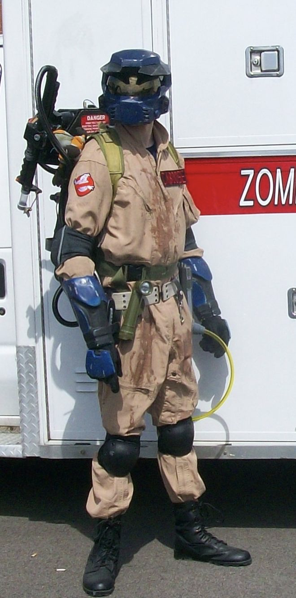
 

This costume features a complete Halo Universe costumes as its base, and as such would qualify for Deployment as a mash up costume:

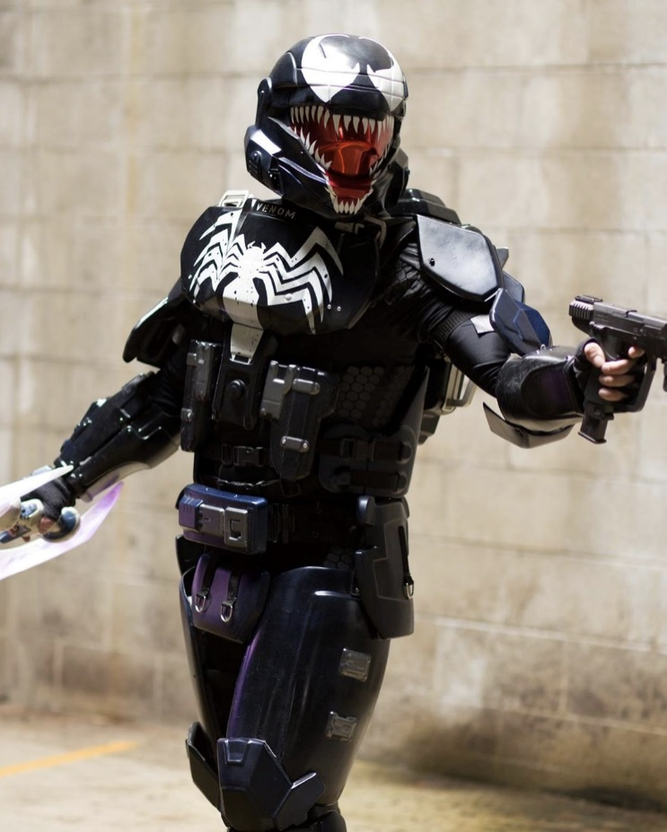

### Mix and Match Armor

- These are costumes that mix armor components from across different games or media in a fashion not seen or described in any in-universe media or references. Examples include Halo 4 armor with Halo Reach components, such as Halo 4 chest, arm, and leg armor, with a Halo Reach cod/butt armor and helmet, or use of a Forward Unto Dawn helmet with Halo 3 Mark VI armor.

- Usage of different armor pieces must be symmetrical, e.g. Both shins must be from the same game, front and back armor must be from the same game, so as to create a more uniform look.

- Mix of no more than 3 game armor styles. 

- These costumes are only approvable at a **Tier 1** level.

- Halo Infinite's "cross core" helmet and shoulder utilization is an exception to this rule, as the usage of helmets and shoulders across cores and armor sets is able to be done in-game, and is therefore eligible for **Tier 2** and **Tier 3** status.

For example, this costume would be limited to a **Tier 1** due to the mix of a Halo Reach Commando helmet with a Halo CE body, a combination unable to be replicated in any game.

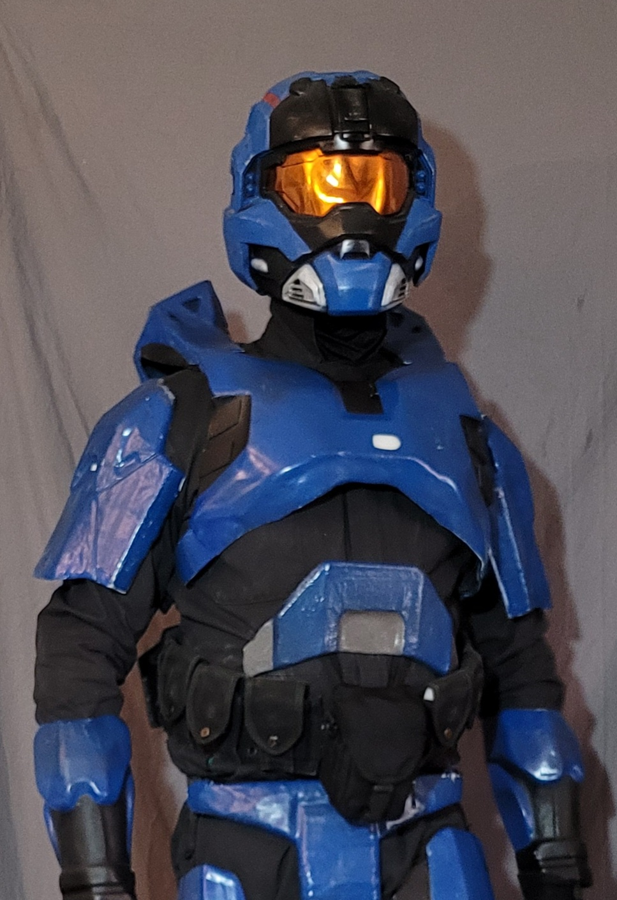

## Personalization:
### Color Reference:
The following examples are based off a Halo 3 Spartan, so what can be replicated in Halo 3's multiplayer applies.
 
**Tier 1**: This color scheme is not able to be replicated in Halo 3's Multiplayer, and the number and placement of colors does not align with the Halo 3 UNSC Design Language.

 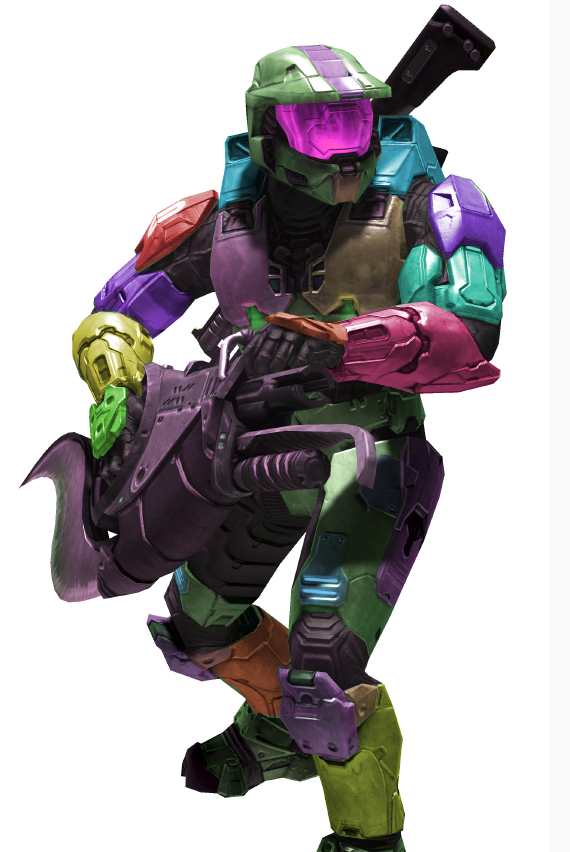

 **Tier 2**: This color scheme is not able to be replicted in Halo 3's Multiplayer, but the number and placement of colors better aligns with the Halo 3 UNSC Design Language.

 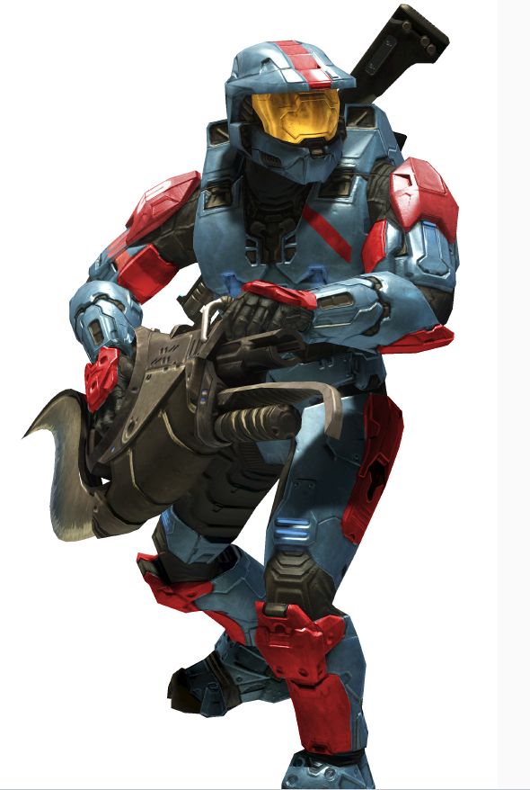

  **Tier 3**: This is a color scheme that can be replicated in Halo 3's Multiplayer, and as such its use would qualify for a Tier 3.
 
  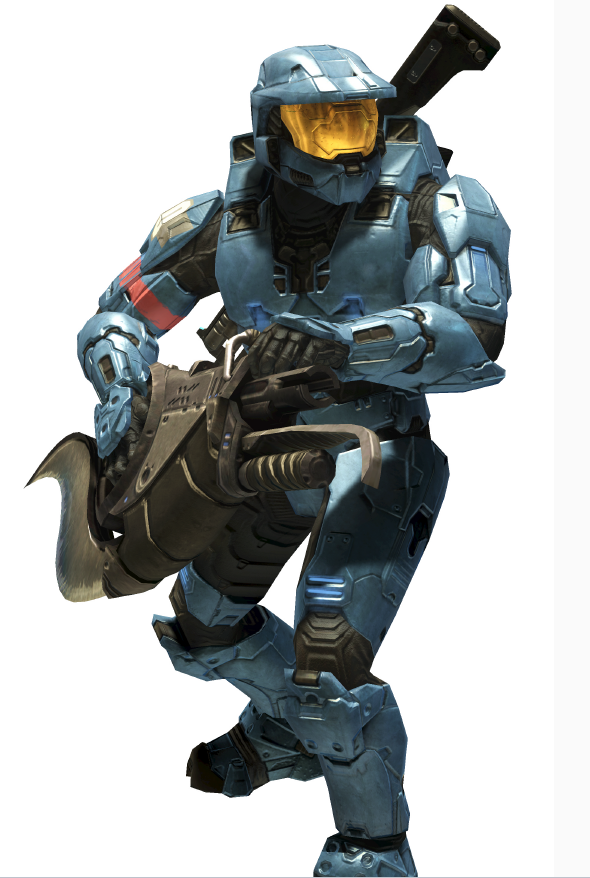

### Personalization Reference:
The following would be limited to **Tier 1** for personalization for an ODST due to the use of recognizable imagery from another franchise.
 
 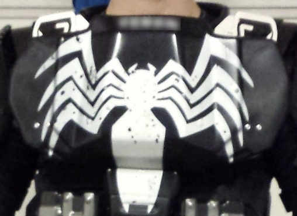

The following is an example of **Tier 2** personalization for an ODST due to the use of a logo not found in Halo's multiplayer customization options or seen in any official Halo media, but does not reference any other franchise or fictional universe:

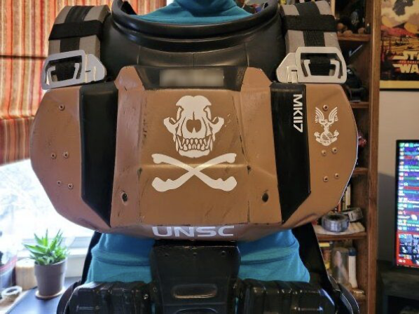
 
The following is an example of **Tier 3** personalization for an ODST due to only containing logos and details found in-game.  This does include the use of the user's last name or callsign or nickname in the top position matching the placement on the armor worn by the members of Alpha-Nine in Halo 3: ODST, but omitted for privacy in this example:

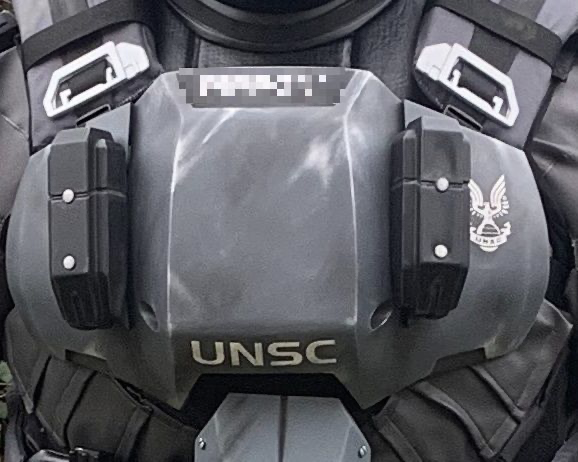
 

The following are further examples of **Tier 1** Personalization marks:

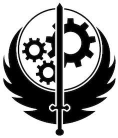 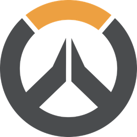 

The following are further examples of **Tier 2** Personalization marks:

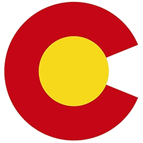  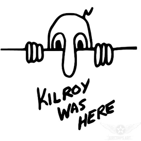

The following are further examples of **Tier 3** Personalization marks:

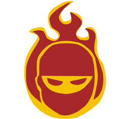  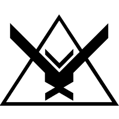                       

## Tier Specific Finishing Examples:
### Pepakura Finishing Reference:
These are examples of the construction detail level for each tier and do not necessarily include requirements around paint and weathering.

**Tier 1**, polygonal appear indicative of Pepakura is still present due to little or no smoothing techniques applied to the piece:
   
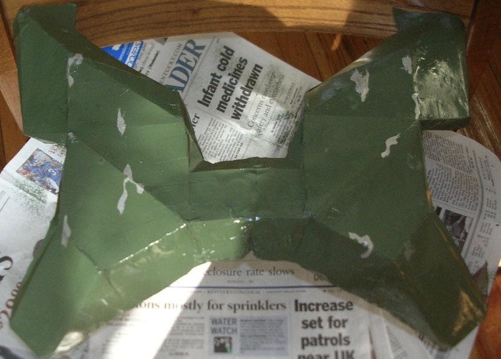

**Tier 2**, while smoothed, there are still rough patches indicating the base method and materials used:
  
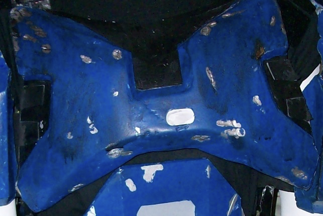

**Tier 3**, the piece has been smoothed and detailed to the point that the base material or method is no longer obvious: 

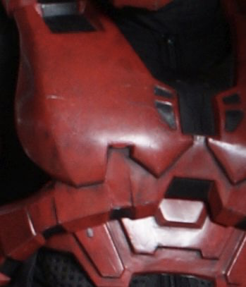

### Foam Build Reference
These are examples of the construction detail level for each tier and do not necessarily include requirements around paint and weathering.

**Tier 1**, there are large gaps and unfilled seams that make the base construction method of foam visible:

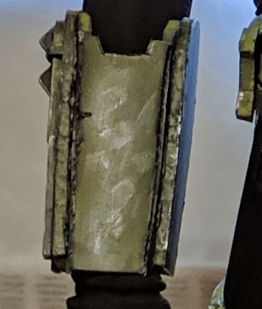

**Tier 2**, the construction of the piece is such that seams are minimized and filled, but some cuts are not as smooth or symmetrical and seams, while filled, are still able to be identified:
 
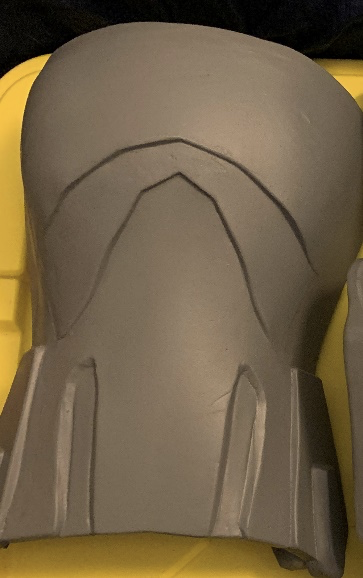

**Tier 3**, the construction of the piece is such that seams are minimized or filled and smoothed to the point that the base material or method is no longer obvious:

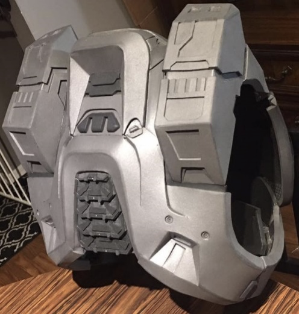

### 3D Print Build Reference
These are examples of the filling and sanding level expected for each tier and does not include the necessary paint, weathering, or finishes expected.

**Tier 1**, little to no smoothing or filling of print lines has been completed:

 
**Tier 2**, print lines have had post processing and filling, but are still visible in small places such as corners or recessed areas: 

**Tier 3**, the piece has been smoothed and detailed to the point that the base material or method is no longer obvious:

